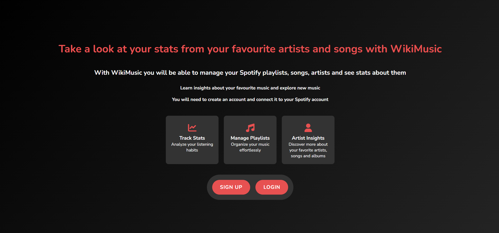
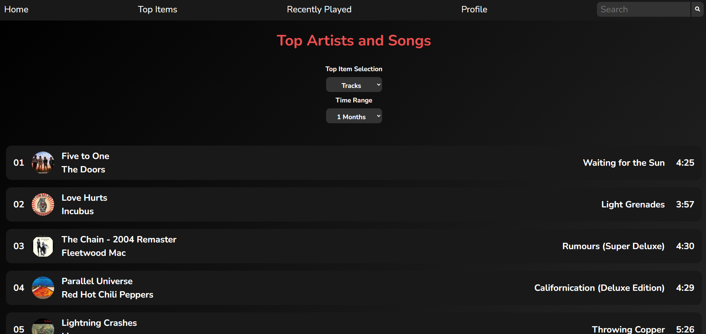

# 🎵 WikiMusic

A powerful web application that connects with your Spotify profile to provide detailed insights about your music preferences. Discover statistics about your favorite artists and songs, track your listening habits, and explore your musical journey.

## ✨ Features

-   🎧 **Spotify Integration**: Direct connection with your Spotify profile
-   📊 **Listening Statistics**: Detailed analysis of your music preferences
-   🎸 **Top Artists**: Discover your most listened artists
-   🎼 **Top Songs**: Track your favorite songs
-   📈 **Activity Tracking**: Monitor your recent listening activity
-   🔍 **Music Search**: Find new artists and songs

## 🌟 Key Features Showcase

### Landing Experience

### Statistics Dashboard

## 🚀 Technologies

### Languages

-   JavaScript
-   HTML
-   CSS

### Frameworks & Tools

-   Node.js
-   Express.js
-   Spotify Web API

### Database

-   PostgreSQL
